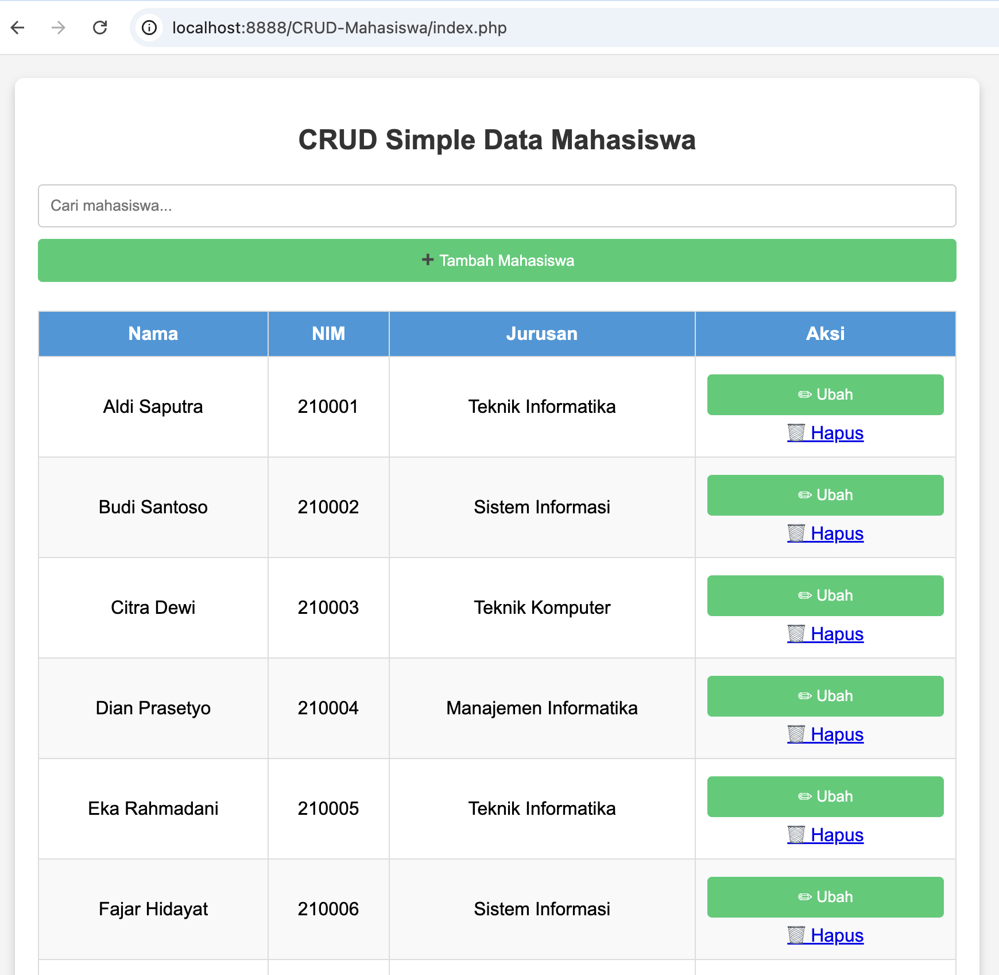

 CRUD Data Mahasiswa dengan PHP, MySQL, dan JavaScript
🚀 Aplikasi CRUD (Create, Read, Update, Delete) Data Mahasiswa ini dibangun menggunakan PHP Native dengan MySQL sebagai database dan JavaScript modern untuk fitur Live Search dan Modal Form.

🎯 Fitur Aplikasi :  
✅ Tambah Mahasiswa menggunakan modal popup  
✅ Edit Data Mahasiswa langsung dari tabel dengan modal  
✅ Hapus Data Mahasiswa dengan konfirmasi  
✅ Live Search menggunakan AJAX Fetch API  
✅ Tampilan Modern & Responsif menggunakan CSS  
✅ Clean Code & Modular dengan Functional Programming  

📂 Struktur Folder  
/crud-php 
│── assets/
│   ├── style.css      # Styling tampilan 
│── config.php         # Koneksi database & fungsi CRUD 
│── index.php          # Tampilan utama (1 halaman CRUD) 
│── script.js          # Live Search & Modal Form 

📥 Instalasi & Cara Menjalankan :  
1️⃣ Clone Repository 
git clone https://github.com/username/crud-php.git 
cd crud-php 

2️⃣ Import Database 
- Buka phpMyAdmin 
- Buat database baru, misalnya: kampus_db 
- Jalankan query berikut untuk membuat tabel: 
CREATE TABLE mahasiswa (
    id INT AUTO_INCREMENT PRIMARY KEY,
    nama VARCHAR(100) NOT NULL,
    nim VARCHAR(20) NOT NULL UNIQUE,
    jurusan VARCHAR(50) NOT NULL
); 

Tambahkan data dummy (opsional): 
INSERT INTO mahasiswa (nama, nim, jurusan) VALUES
('Aldi Saputra', '210001', 'Teknik Informatika'),
('Budi Santoso', '210002', 'Sistem Informasi'),
('Citra Dewi', '210003', 'Teknik Komputer');
 

3️⃣ Jalankan di Server Lokal 
Gunakan XAMPP / MAMP / Laragon lalu buka browser: 
http://localhost/crud-php/

## 🖥️ Screenshot Tampilan  

